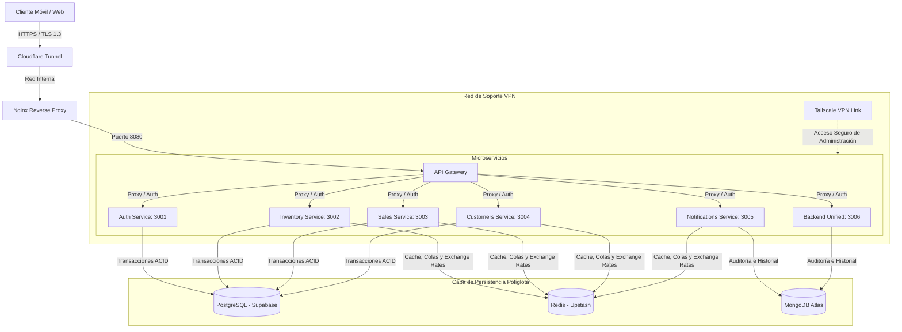

# 🚀 Confimax - Sistema de Ventas, Inventario e Inteligencia de Negocios

[](https://github.com/uptai/confimax)
[](#-arquitectura-tecnológica-y-patrones)
[](#-persistencia-políglota-y-justificación)
[](#-ecosistema-móvil-offline-first)
[](#-seguridad-red-y-comunicaciones)

**Confimax** es una plataforma empresarial de última generación diseñada para la gestión integral de ventas, control de inventario en tiempo real e inteligencia de negocios. Concebido bajo los estándares académicos y técnicos más rigurosos del **Trayecto IV del PNF en Informática de la UPTAI**, este sistema implementa una arquitectura distribuida basada en microservicios, persistencia políglota, capacidades sin conexión (offline-first) y un flujo de red avanzado altamente seguro.

---

## 📋 Tabla de Contenido
1. [Resumen del Sistema](#-resumen-del-sistema)
2. [Arquitectura Tecnológica y Patrones](#-arquitectura-tecnológica-y-patrones)
3. [Persistencia Políglota y Justificación](#-persistencia-políglota-y-justificación)
4. [Estructura del Proyecto y Microservicios](#-estructura-del-proyecto-y-microservicios)
5. [Ecosistema Móvil Offline-First](#-ecosistema-móvil-offline-first)
6. [Panel Administrativo Web](#-panel-administrativo-web)
7. [Seguridad, Red y Comunicaciones](#-seguridad-red-y-comunicaciones)
8. [Estrategia de Calidad y Testing](#-estrategia-de-calidad-y-testing)
9. [Observabilidad y Telemetría](#-observabilidad-y-telemetría)
10. [Instalación, Ejecución y Despliegue](#-instalación-ejecución-y-despliegue)

---

## 🌟 Resumen del Sistema

Confimax está estructurado para resolver los problemas críticos de empresas comerciales modernas: la pérdida de ventas por caídas de conectividad (mediante un motor de sincronización offline-first), la lentitud en la carga de datos transaccionales, y la falta de auditoría sobre quién consulta y modifica la información de inventario.

### Características Clave
* **Resiliencia Total**: Aplicación móvil capaz de facturar y registrar clientes 100% offline, sincronizando los datos automáticamente al recuperar la red.
* **Seguridad de Nivel Financiero**: Aislamiento total de servicios de bases de datos mediante redes virtuales privadas y túneles encriptados de extremo a extremo.
* **Desempeño y Escalabilidad**: Distribución inteligente de carga usando un API Gateway que rutea dinámicamente y protege los microservicios con límites de consumo por cliente (Rate Limiting).
* **Auditoría e Inteligencia de Negocios**: Registro inmutable de eventos de lectura/escritura para análisis técnico y operario a través de dashboards interactivos.

---

## 🛠️ Arquitectura Tecnológica y Patrones

El backend de Confimax adopta la **Arquitectura Hexagonal (Ports and Adapters)** junto con un diseño orientado a **Microservicios**. Este enfoque garantiza el total desacoplamiento entre las reglas de negocio (Dominio), los casos de uso (Aplicación), y los clientes/servicios externos (Infraestructura).



### Principales Beneficios de la Arquitectura
1. **Mantenibilidad**: Los cambios en bases de datos o servicios externos no afectan el código de negocio central.
2. **Escalabilidad Horizontal**: Cada microservicio cuenta con recursos Docker acotados y puede escalarse de manera independiente según la demanda.
3. **Desacoplamiento Tecnológico**: Permite combinar múltiples tipos de almacenamiento y lenguajes de programación en base al objetivo específico de cada microservicio.

---

## 💾 Persistencia Políglota y Justificación

Confimax utiliza tres motores de bases de datos diferentes, cada uno seleccionado rigurosamente según el tipo de datos y la operación de negocio:

### 1. PostgreSQL (Supabase Cloud)
* **Caso de Uso**: Gestión de transacciones financieras, saldos, facturación, cuentas de usuarios y relaciones de clientes.
* **Justificación**: Garantiza la máxima consistencia e integridad de los datos mediante transacciones **ACID** (Atomicity, Consistency, Isolation, Durability) y restricciones relacionales estrictas.
* **Uso en Microservicios**: `auth-service`, `inventory-service`, `sales-service`, `customers-service`.

### 2. MongoDB Atlas (Cloud NoSQL)
* **Caso de Uso**: Logs de auditoría de seguridad, trazabilidad de consultas de stock (quién consultó qué y cuándo) e historial de notificaciones enviadas.
* **Justificación**: Diseñado para el almacenamiento masivo de datos no estructurados o semiestructurados con alta velocidad de escritura, evitando sobrecargar la base de datos transaccional principal con información puramente analítica e histórica.
* **Uso en Microservicios**: `notifications-service`, `backend` (Logs de Auditoría).

### 3. Redis (Upstash Cloud & Local Container)
* **Caso de Uso**: Cacheo de tasas de cambio (Dólar/Peso), sesiones activas de usuarios, colas de sincronización masiva y Rate Limiting.
* **Justificación**: Lecturas y escrituras en memoria en submilisegundos. Libera a PostgreSQL de lecturas repetitivas y protege a la API contra saturación de peticiones concurrentes.

---

## 📂 Estructura del Proyecto y Microservicios

La organización del repositorio divide claramente las responsabilidades del sistema distribuido:

```
Confimax/
├── config/                  # Archivos de configuración (Nginx, Redis, Mongo, Grafana)
├── docs/                    # Planos de arquitectura y guías adicionales
├── mobile/                  # Aplicación móvil híbrida (Expo / React Native)
├── monitoring/              # Configuración de Prometheus, Grafana y dashboards
├── nginx/                   # Configuración del servidor Nginx (Reverse Proxy & SSL)
├── prisma/                  # Esquemas y migraciones Prisma para PostgreSQL
├── scripts/                 # Scripts de inicialización, siembra de datos (seeders) y chequeos
├── services/                # Código fuente de los microservicios backend
│   ├── api-gateway/         # Ruteador central y controlador de seguridad global
│   ├── auth-service/        # Gestión de autenticación, registro y sesiones de usuarios
│   ├── backend/             # Backend unificado / agregador principal con logs integrados
│   ├── customers-service/   # Control y saldos de la cartera de clientes
│   ├── inventory-service/   # Catálogo de productos, SKUs y niveles de stock
│   ├── notifications-service/# Servidor de notificaciones y logs Mongo
│   ├── sales-service/       # Transacciones de venta y facturación
│   └── shared/              # Módulos y base de datos compartidos por los servicios
├── tests/                   # Suite de pruebas unitarias, integración, carga e infraestructura
└── web/                     # Panel administrativo web corporativo (Next.js)
```

---

## 📱 Ecosistema Móvil Offline-First

El cliente móvil de Confimax está desarrollado en **React Native / Expo v54** con **React 19** y **Zustand** para la gestión de estados globales del cliente. Para cumplir con el requerimiento de resiliencia del sector comercial, implementa un modelo **Offline-First**.

### Componentes de Sincronización Local:
* **WatermelonDB**: Base de datos relacional local basada en SQLite de altísimo rendimiento para el ecosistema móvil. Permite renderizaciones rápidas de listas de miles de productos mediante lazy loading.
* **Vector Clocks (Relojes Vectoriales)**: Algoritmo integrado para detectar la causalidad y concurrencia de datos entre las versiones del cliente móvil y el servidor backend, permitiendo identificar conflictos antes de procesar cambios.
* **Estrategia "Last Write Wins" (LWW)**: Los conflictos de concurrencia se resuelven de forma inteligente basada en timestamps precisos agregados a cada registro.
* **Cola de Sincronización Local (`sync_queue`)**: Los cambios realizados offline (nuevas ventas, actualizaciones de clientes) se encolan automáticamente en local.
* **NetInfo Network Listener**: Monitorea el estado de red del móvil. Al detectar la transición a "Online", dispara una sincronización bidireccional inmediata en segundo plano:
  1. `syncProducts()`: Descarga actualizaciones de stock y nuevos productos.
  2. `syncCustomers()`: Actualiza el listado y balances de crédito de los clientes.
  3. `pushPendingChanges()`: Sube y procesa la cola de ventas y registros locales pendientes al backend.

---

## 💻 Panel Administrativo Web

El panel de administración central de Confimax es una aplicación interactiva construida con **Next.js 16 (App Router)** y **TypeScript**.

### Puntos Destacados de Diseño y Frontend:
* **Aesthetics Premium**: Interfaz moderna, minimalista y adaptable (totalmente responsive), diseñada para encantar a los usuarios y soportar temas claro y oscuro persistentes.
* **Animaciones Fluídas**: Integra **GSAP** y **Framer Motion** para microinteracciones de interfaz de usuario y animaciones sofisticadas en gráficos y menús que brindan una experiencia de usuario premium.
* **Estructura Semántica**: Construido bajo las mejores prácticas de accesibilidad y SEO, estructurando encabezados lógicos y etiquetas HTML5 semánticas.

---

## 🔐 Seguridad, Red y Comunicaciones

La red interna y el acceso al ecosistema de Confimax han sido blindados para cumplir con las exigencias del jurado técnico de la UPTAI:

```
[Cliente Externo]  ───( HTTPS / TLS 1.3 )───►  [Cloudflare Tunnel]
                                                       │
                                               ( Red Privada )
                                                       │
                                                       ▼
[Servidores de Base de Datos Cloud] ◄───► [Nginx Proxy (8080)] ◄───► [API Gateway]
(Supabase, Upstash, Atlas via VPN)                                       │
                                                                 ( Microservicios )
                                                                 - auth-service (3001)
                                                                 - inventory-service (3002)
                                                                 - sales-service (3003)
                                                                 - customers-service (3004)
```

### Medidas de Red Implementadas:
* **Cloudflare Tunnel**: Expone públicamente la aplicación web y el API Gateway sin necesidad de abrir puertos directos en el cortafuegos del servidor.
* **Nginx como Proxy Inverso**: Centraliza las conexiones entrantes en el puerto HTTP/HTTPS del host, configurado con políticas estrictas de cifrado **TLS 1.2 y TLS 1.3 obligatorio** y inyección de cabeceras de seguridad (`X-Frame-Options`, `Content-Security-Policy`).
* **Tailscale VPN Mesh**: Permite a los administradores y desarrolladores conectarse a las herramientas internas de base de datos (pgAdmin, Mongo Express, Redis Commander, Grafana) de forma 100% segura mediante una red privada cifrada.
* **Centralización en API Gateway**: El API Gateway es el único punto de entrada público a los microservicios. Implementa **Helmet** para Headers HTTP seguros, **CORS** restringido y **Rate Limiting** por dirección IP a través de Redis para mitigar ataques de denegación de servicio (DDoS).

---

## 🧪 Estrategia de Calidad y Testing

Confimax posee un plan de pruebas robusto diseñado para verificar tanto el comportamiento funcional como el cumplimiento estructural de los patrones arquitectónicos:

### 1. Test Runner UI & API Tester (Web)
El backend incluye dos herramientas web embebidas interactivas muy útiles para la evaluación rápida:
* **Test Runner UI** (`http://localhost:3006/api/tests`): Ejecuta los tests unitarios y de integración directamente desde el navegador y muestra estadísticas de éxito en tiempo real.
* **API Tester** (`http://localhost:3006/api/tester`): Interfaz web para realizar peticiones interactivas a la API del backend. Autocompleta automáticamente tokens JWT tras iniciar sesión.

### 2. Pruebas de Arquitectura Hexagonal
Jest valida las dependencias de las capas. Por ejemplo, asegura que ningún archivo de la capa de *Dominio* intente importar componentes de *Infraestructura* (como Express o clientes SQL):
```bash
# Ejecutar tests de diseño estructural hexagonal
docker-compose --profile test run --rm hexagonal-tests
```

### 3. Pruebas de Rendimiento y Carga (Stress Testing)
Diseño de pruebas de estrés utilizando **k6** para evaluar la resistencia del API Gateway ante picos de carga masivos:
* Soporta la simulación de **500+ usuarios concurrentes** realizando consultas y registros de stock simultáneamente.
* Genera archivos de reporte JSON automatizados detallando latencia promedio, percentil P95 y tasas de error.

---

## 📊 Observabilidad y Telemetría

La observabilidad es un pilar fundamental en el ecosistema productivo de Confimax:

* **Prometheus + Node Exporter**: Monitorea de forma continua el consumo de hardware (procesador, memoria RAM, escrituras en disco) de los contenedores Docker en el host.
* **Grafana Dashboards**: Interfaz de visualización con dashboards personalizados y provistos automáticamente para registrar:
  * Uso de CPU y RAM de cada microservicio en tiempo real.
  * Tasa de peticiones por segundo en el API Gateway y códigos de respuesta de red (200, 4xx, 5xx).
  * Alertas configuradas para notificar picos de CPU inusuales (>80%) o de memoria crítica.

---

## 🚀 Instalación, Ejecución y Despliegue

### Requisitos del Sistema
* Node.js v18 o superior
* Docker v24 o superior
* Docker Compose v2 o superior

### 🔧 Paso 1: Configurar Variables de Entorno
1. Copia el archivo de plantilla a tu archivo de configuración de desarrollo local:
   ```bash
   cp .env.example .env
   ```
2. Rellena los datos de conexión correspondientes para Supabase (PostgreSQL), Upstash (Redis) y MongoDB Atlas en el archivo `.env`.

### 🏠 Paso 2: Ejecución en Entorno Local (Docker)
Levanta el stack completo de microservicios, bases de datos y herramientas de administración con un solo comando:
```bash
# Levantar el sistema en segundo plano
npm start

# Verificar el estado de los contenedores
npm run status

# Ver los logs en tiempo real de todos los microservicios
npm run logs

# Detener los servicios sin borrar datos
npm stop
```

#### Puertos locales útiles tras iniciar el sistema:
* **API Gateway (Punto de Entrada API)**: `http://localhost:8080`
* **Pruebas y Dashboard Interactivo**: `http://localhost:3006/api/tests`
* **Next.js Web Admin**: `http://localhost:3000`
* **pgAdmin (PostgreSQL GUI)**: `http://localhost:5050`
* **Redis Commander (Redis GUI)**: `http://localhost:8082`
* **Mongo Express (MongoDB GUI)**: `http://localhost:8090`
* **Grafana Metrics**: `http://localhost:3001` (Credenciales por defecto: `admin` / `Jackson1`)

---

### 🧪 Paso 3: Ejecución de Tests
Puedes ejecutar los tests Jest unitarios e integración utilizando la configuración de Docker Compose provista:
```bash
# Ejecutar suite completa de tests de integración del backend
docker-compose --profile test run --rm backend-tests npm test

# Ejecutar tests de arquitectura hexagonal
docker-compose --profile test run --rm hexagonal-tests
```

---

### 🌐 Paso 4: Despliegue en Producción (Coolify)
El proyecto está optimizado para su despliegue continuo en tu propio servidor a través de **Coolify** mediante el archivo `docker-compose.coolify.yml`:
1. Registra tu servidor en Coolify y conecta tu repositorio Git de GitHub.
2. Añade una nueva aplicación del tipo **Docker Compose** usando `docker-compose.coolify.yml`.
3. Configura tus variables de entorno sensibles (como `JWT_SECRET` y passwords) en la sección **Secrets** de Coolify para mantenerlos encriptados.
4. Asigna los dominios públicos correspondientes (ej. `https://confimax.tuservidor.com` y `https://api.tuservidor.com`) en las configuraciones de Next.js y API Gateway.
5. Haz clic en **Deploy** y Coolify aprovisionará el balanceo de carga, certificados SSL/TLS automáticos de Let's Encrypt y los puertos necesarios.

---

### 🆘 Plan de Contingencia y Recuperación de Desastres
Para conocer los pasos operativos detallados si se presenta una caída en la conexión de red externa o la indisponibilidad de la nube de Cloudflare, consulta el archivo de soporte de red en [Plan de Contingencia](file:///d:/Proyectos/Confimax/UPTAI_ANALYSIS.md#L388-L442).

---

Desarrollado y mantenido con dedicación para el **Trayecto IV de Ingeniería en Informática (UPTAI)**. 🎓
